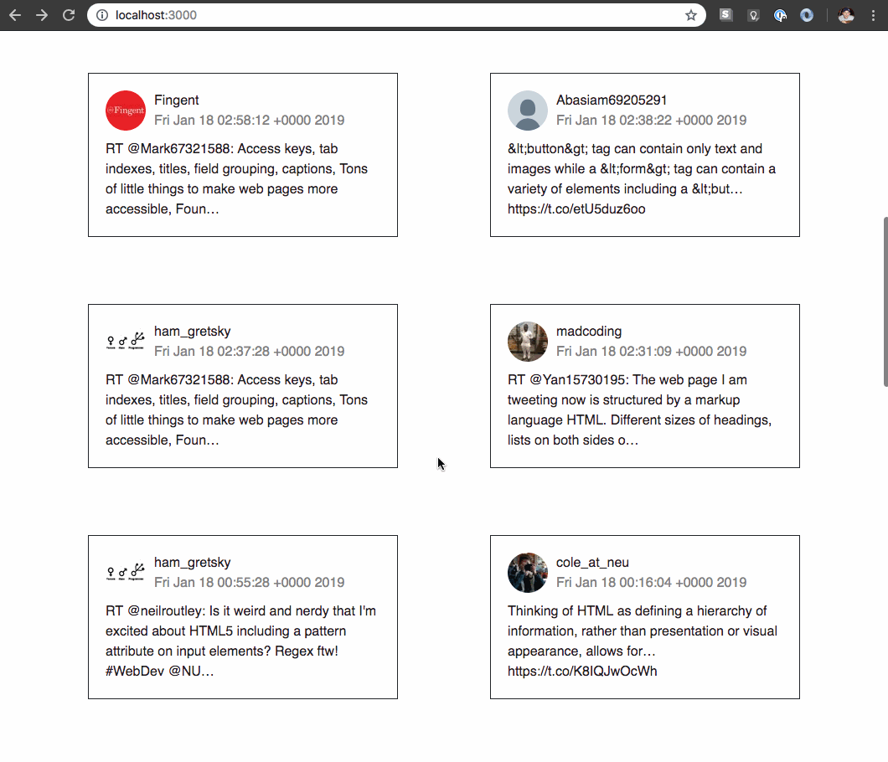

# TweetSearch

A front-end and back-end example using Node+Express, HTML, CSS, and JavaScript to display tweets from a local JSON file. Search bar will filter displayed tweets by twitter user-name. Here is how you can download and install this app.

## Preview



## Installation

```
git clone git@github.com:neilroutley/tweetSearch.git
npm install
npm start
```

And then point your browser to http://localhost:3000